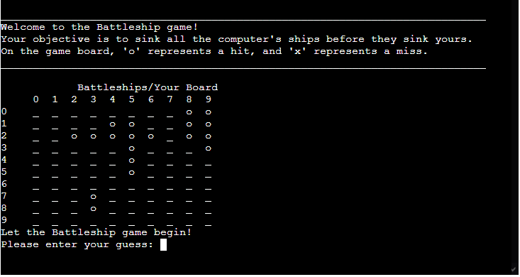
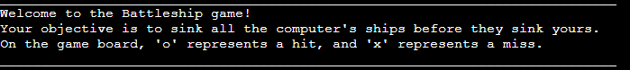
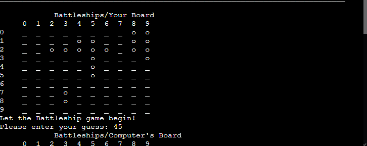
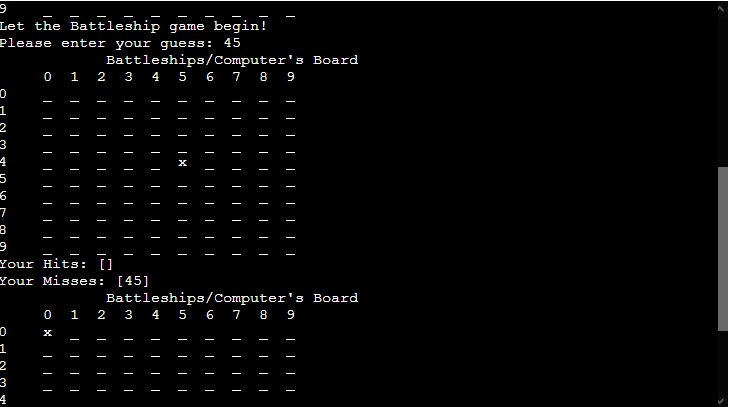
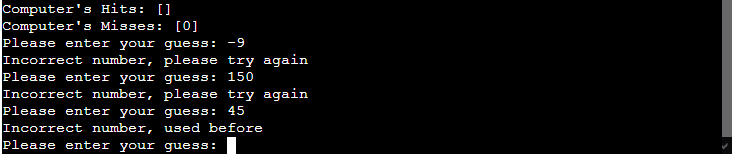
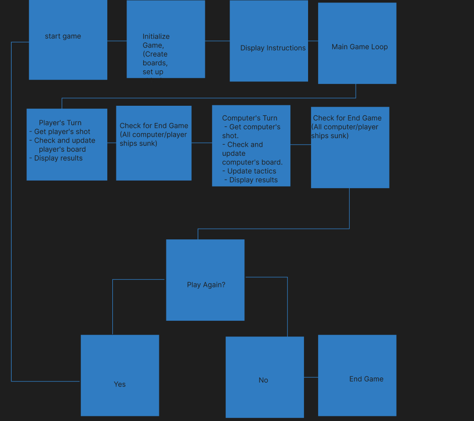
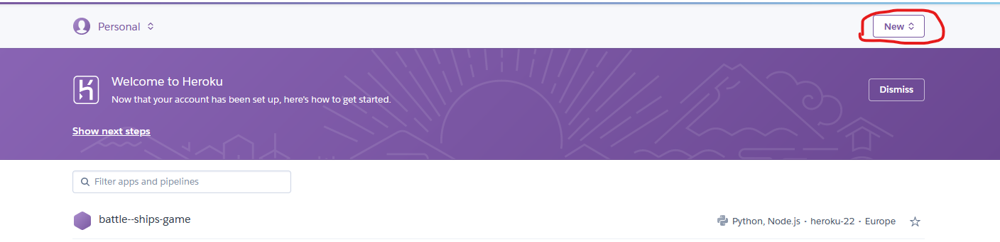
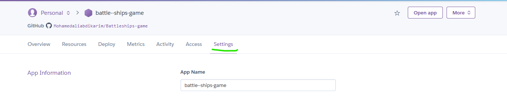

# Batlleship Game

This project introduces a classic Battleships game, engagingly run and played within the terminal. The system operates seamlessly on a mock terminal hosted through Heroku. The primary objective of the game is to strategically destroy the computer's battleships. Players achieve this by making educated guesses on the grid coordinates where the opponent's battleships might be located and firing upon those positions. The challenge lies in outsmarting the computer, aiming to sink its battleships before it discovers and annihilates all of yours.

click here to play the game:[Battleship Game](https://battle--ships-game-32bc95ec5108.herokuapp.com/)

# How to Play
- A random board is generated, with battleships strategically placed for both the computer and the human player.

- The player's board displays their own ships marked with a 'o' symbol, offering a clear view of their fleet. Meanwhile, the computer's pieces remain concealed, adding an element of mystery to the game.

# Features
-------- 
## Existing Features
When initiating the game, the rules will be audibly presented to you.

This code generates two game boards: one for the player and one for the computer. The specified number of ships are randomly positioned on the board when the game starts. The player's board displays the locations of all their ships, while the computer's board conceals the positions of its ships

- Input validation and checks are implemented to ensure the following conditions: 
-  Inputs must be restricted to integers; letters, floats, or negative numbers are not allowed.
- Inputs must be restricted to integers; letters, floats, or negative numbers are not allowed.
- Coordinated that have already been guessed before cannot be re-entered.

## future features
- Allow users to choose the size of the game board before starting a new game.
- This could include variations such as 8x8 or 12x12 grids.
- Allow players to customize their ship layouts before the game starts.
- Implement a scoring system based on the number of moves or time taken to complete the game.
- Create a leaderboard to track and display high scores.

# Data Model
## flow chart
The flowchart I created has been incredibly useful in guiding me through the process of developing the Battleship game. It serves as a roadmap, helping me understand the flow and direction to take in building the game. By visualizing each step, I've been able to gain a clearer understanding of how the game unfolds, the decisions it makes, and how each part of the code fits together.

The flowchart provides a structured and organized representation of the entire game process. It has assisted me in identifying key components, logical branches, and termination conditions. When referring to the diagram, I can quickly analyze which parts of the code are responsible for specific steps in the game.

The visual representation has also facilitated my planning and implementation of various features. Following the flowchart, I've been able to organize my code more effectively, and it has given me a clearer direction when developing the different game mechanisms.

Overall, this flowchart has been an invaluable resource, providing me with a solid understanding of how to build and structure the Battleship game. It has served as a helpful reference throughout the entire development process, contributing to making my code more organized and intuitive.

#  Deployment
- Begin by forking the repository on GitHub or cloning it to your local machine using the following command
- Ensure you have a Heroku account. If not, sign up for an account on the Heroku website.

- click on the button in the right corner to create a new app.

