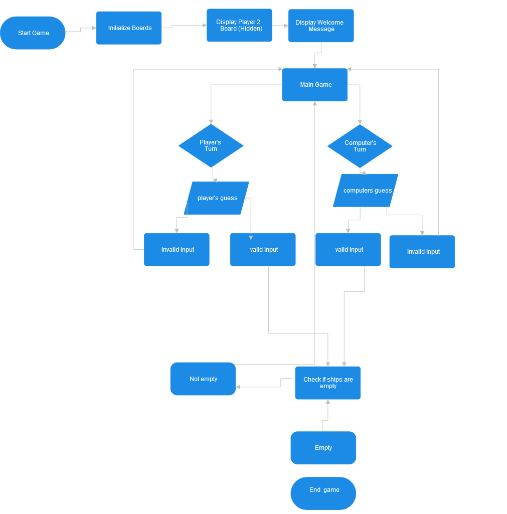
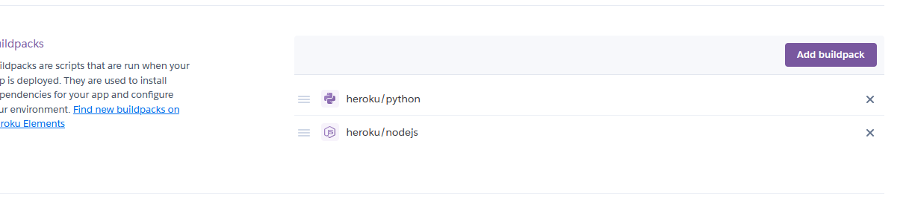

# Batlleship Game

This project introduces a classic Battleships game, engagingly run and played within the terminal. The system operates seamlessly on a mock terminal hosted through Heroku. The primary objective of the game is to strategically destroy the computer's battleships. Players achieve this by making educated guesses on the grid coordinates where the opponent's battleships might be located and firing upon those positions. The challenge lies in outsmarting the computer, aiming to sink its battleships before it discovers and annihilates all of yours.

click here to play the game:[Battleship Game](https://battle--ships-game-32bc95ec5108.herokuapp.com/)

# How to Play
- A random board is generated, with battleships strategically placed for both the computer and the human player.

- The player's board displays their own ships marked with a 'o' symbol, offering a clear view of their fleet. Meanwhile, the computer's pieces remain concealed, adding an element of mystery to the game.

# Features
-------- 
## Existing Features
When initiating the game, the rules will be audibly presented to you.

This code generates two game boards: one for the player and one for the computer. The specified number of ships are randomly positioned on the board when the game starts. The player's board displays the locations of all their ships, while the computer's board conceals the positions of its ships

- Input validation and checks are implemented to ensure the following conditions: 
-  Inputs must be restricted to integers; letters, floats, or negative numbers are not allowed.
- Inputs must be restricted to integers; letters, floats, or negative numbers are not allowed.
- Coordinated that have already been guessed before cannot be re-entered.

## future features
- Allow users to choose the size of the game board before starting a new game.
- This could include variations such as 8x8 or 12x12 grids.
- Allow players to customize their ship layouts before the game starts.
- Implement a scoring system based on the number of moves or time taken to complete the game.
- Create a leaderboard to track and display high scores.

# Data Model
## flow chart
The flowchart I created has been incredibly useful in guiding me through the process of developing the Battleship game. It serves as a roadmap, helping me understand the flow and direction to take in building the game. By visualizing each step, I've been able to gain a clearer understanding of how the game unfolds, the decisions it makes, and how each part of the code fits together.

The flowchart provides a structured and organized representation of the entire game process. It has assisted me in identifying key components, logical branches, and termination conditions. When referring to the diagram, I can quickly analyze which parts of the code are responsible for specific steps in the game.

The visual representation has also facilitated my planning and implementation of various features. Following the flowchart, I've been able to organize my code more effectively, and it has given me a clearer direction when developing the different game mechanisms.

Overall, this flowchart has been an invaluable resource, providing me with a solid understanding of how to build and structure the Battleship game. It has served as a helpful reference throughout the entire development process, contributing to making my code more organized and intuitive.

# Testing 

To validate my project, I conducted the following manual tests.
- Verified the code using pep8online to ensure compliance with coding standards, confirming the absence of any errors
- Demonstrated the program's robustness by testing validations, including entering invalid inputs to verify proper handling of errors (e.g., exceeding board size parameters, preventing duplicateinputs, and rejecting string inputs).
- Executed tests in both the local terminal and the Code Institute Heroku Terminal to ensure consistent functionality across different environments
# Bugs
### Solved Bugs
- There were numerous bugs in the code. For example, the restart function wasn't working.
- The player board and computer board were swapped.
### Unsolved Bugs
There are no unfixed bugs found on the project.

#  Technologies Used
 - GitHub - The site was used to edit and host the website.
 - Python - This was used in the production to get the game running as it is required for the app to run.
 - Node.js - This was used in the production to get the game running as it is required for app to run.
 - pep8online - This site was used to validate the python code to check for any errors within my writing.
 - Heroku - This was used to deploy the game in a mock terminal that allows anyone to play the game online.
 - Python Libary Random - This was used to generate random numbers within the games code for deployment of the ships or the computers random guesses.

#  Deployment
- Begin by forking the repository on GitHub or cloning it to your local machine using the following command
- Ensure you have a Heroku account. If not, sign up for an account on the Heroku website.

- click on the button in the right corner to create a new app.

On the application page, navigate to the settings section, indicated by an underline in green. Within the settings page, locate the "Buildpacks" option and configure them in the specified order: first, set the buildpack to "Python," and then follow it by setting the buildpack to "Node.js." Ensure that the sequence mirrors the arrangement illustrated in the accompanying picture for reference. This step is crucial for the proper configuration and functioning of the application, aligning with the recommended settings for a seamless integration of Python and Node.js within the platform.

- Establish a connection between the Heroku application and the corresponding repository. 
-  Return to the deploy page and opt for either manual or automatic deployment of the site.
-   Once the deployment is complete, you'll be ready to engage with the game and enjoy its features. 

### Cloning of the Project
To generate a local duplicate of the project, adhere to the steps outlined below:
- Navigate to the GitHub repository and locate the code tab beneath the repository name. Click on the code tab.
- In the clone tab, select the HTTPS option. Within this segment, click the clipboard icon to copy the provided repository URL.
- Launch your preferred integrated development environment (IDE) and initiate Git Bash.
- Set the current working directory to the location where you intend to store the cloned repository.
- In the terminal, input "git clone" and then paste the URL obtained from GitHub in step 2.
- Press enter, and your newly cloned repository will be established in the specified location.

# Credits
- I have extracted portions of the code from this [YouTube](https://www.youtube.com/watch?v=GmWHhAGvaQA&list=PLpeS0xTwoWAsn3SwQbSsOZ26pqZ-0CG6i&index=6) video.
- I created a flow chart using [smartdraw.com](smartdraw.com).

# Acknowledgements 
This website stands as the culmination of my efforts during the Portfolio 3 Project for the Full Stack Software Developer (e-Commerce) Diploma at the Code Institute. I extend my heartfelt gratitude to my mentor, Precious Ijege, the invaluable Slack community, and everyone at the Code Institute for their unwavering assistance and support throughout this journey. While Wawas Woods is a fictitious entity, its presence is tangible in every aspect except for the business title. At present, it is more than just a project – it is a passion!
